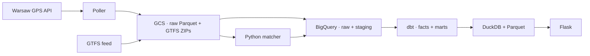

# ZTM Warsaw Pipeline

A data pipeline for analysing Warsaw bus and tram service. It collects vehicle GPS positions, reconstructs trips and stop arrivals against archived timetables, and publishes delay, coverage, and reliability views in a Flask frontend.

Airflow coordinates ingestion, nightly processing, validation, and publication. The frontend reads a local export; page requests do not query BigQuery.

Raw inputs are retained for replay. Each processing date uses a pinned timetable snapshot, and historical results keep the labels and schedule lineage used to build them. Overnight trips are completed when the following day's GPS becomes available.

These are reconstructed observations, not an official record of operated service. Missing GPS or an uncertain match can leave a trip or stop unobserved; neither proves a cancellation.

## Implementation

| Component | Responsibility |
| --- | --- |
| [Poller](poller/) | GPS collection, durable buffering, hourly Parquet partitions. |
| [Airflow](airflow/) | Scheduling, retries, warehouse jobs, export publication. |
| [Matcher](matcher/) | Vehicle-to-duty assignment and stop-arrival reconstruction in DuckDB/Arrow. |
| [dbt](dbt/) | Historical dimensions, partitioned facts, schedule versions, serving marts. |
| [Frontend](frontend/) | Server-rendered archive, rankings, trip detail, and data status. |

[Architecture](docs/architecture.md) covers the data model and its limits. [Local checks](docs/development.md) exercise the code without cloud credentials. [Operations](docs/operations.md) covers deployment and recovery; the full pipeline requires a Warsaw API token, GCS, and BigQuery.
