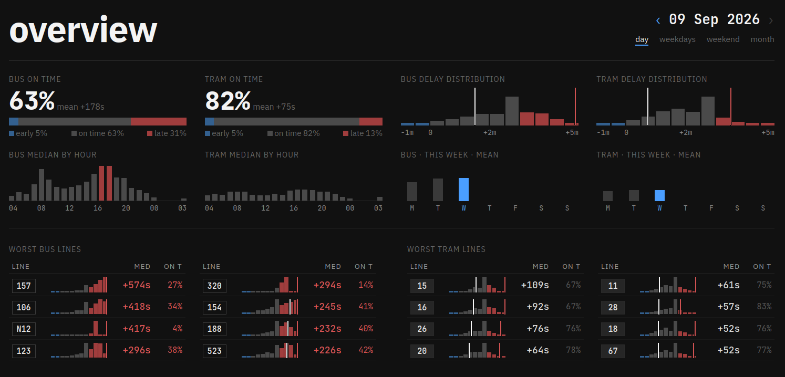

# ZTM Delays

Warsaw bus and tram delays reconstructed from vehicle GPS and archived timetables. A nightly data pipeline turns raw positions into trip histories, stop arrivals, and service coverage, published through a server-rendered web app.

## How it works

The poller collects vehicle positions every 10 seconds and writes Parquet files to Google Cloud Storage. Airflow separately archives changed GTFS feeds—the schedules, stops, routes, and vehicle duties used to interpret those positions. Both inputs are retained so historical dates can be rebuilt.

GPS does not directly tell us which scheduled trip a vehicle is operating or when it reaches each stop. A Python matcher assigns vehicles to sequences of scheduled trips, then aligns their movement with stop occurrences. It records confidence and missing observations rather than treating every nearby GPS point as an arrival.

BigQuery holds the historical warehouse. dbt enriches the matcher outputs with schedule lineage and labels, then builds date-partitioned facts, coverage measures, and display aggregates. Airflow coordinates loading, reconstruction, validation, and publication; the heavy processing runs nightly rather than on each incoming GPS batch.

The frontend reads a local DuckDB export, optionally backed by retained Parquet partitions. Page requests do not query BigQuery. It provides network summaries, line and stop comparisons, individual trip traces, and archive-health views across daily and longer periods.

## History and interpretation

Each processing date uses a pinned timetable snapshot, not whichever schedule is newest at rebuild time. Historical results retain their original labels and schedule lineage. Overnight trips are completed when the next day's GPS becomes available; later rebuilds preserve that evidence.

Ingestion completeness and observed-service coverage are separate measures. Missing GPS, an uncertain match, and a genuinely absent service can look similar in the raw data. These are reconstructed observations, not an official record of operated service: an unobserved trip or stop does not prove a cancellation. Delay summaries use complete trips; detail views expose lower-quality evidence rather than hiding it.

## Implementation

| Component | Responsibility |
| --- | --- |
| [Poller](poller/) | GPS collection, durable buffering, hourly Parquet partitions. |
| [Airflow](airflow/) | Scheduling, retries, warehouse jobs, export publication. |
| [Matcher](matcher/) | Vehicle-to-duty assignment and stop-arrival reconstruction in DuckDB/Arrow. |
| [dbt](dbt/) | Historical dimensions, partitioned facts, schedule versions, serving marts. |
| [Frontend](frontend/) | Flask archive, rankings, trip detail, and data status. |

[Architecture](docs/architecture.md) explains date semantics, the data model, and publication. [Local checks](docs/development.md) exercise the code without cloud credentials. [Operations](docs/operations.md) covers deployment and recovery; the full pipeline requires a Warsaw API token, GCS, and BigQuery.
